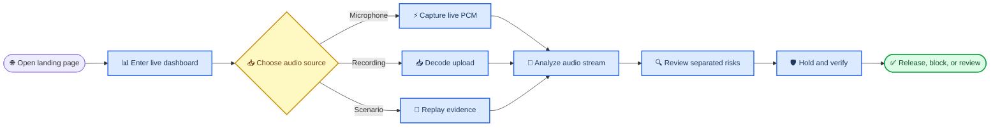
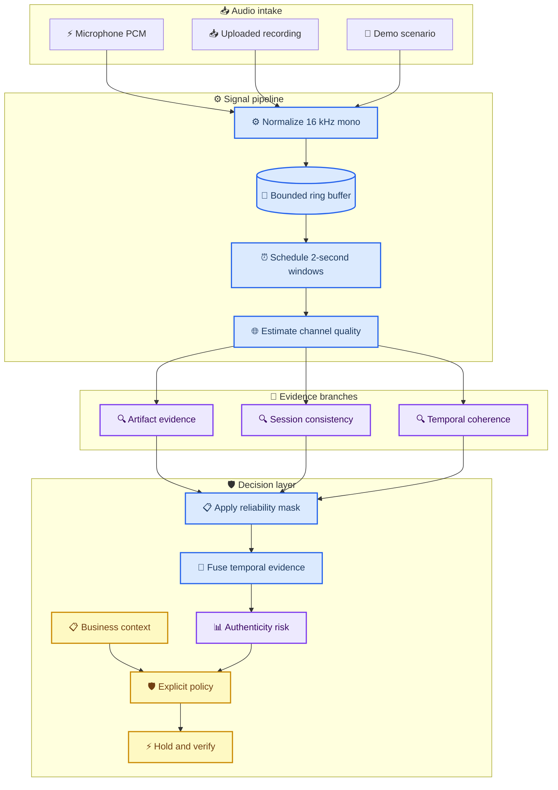
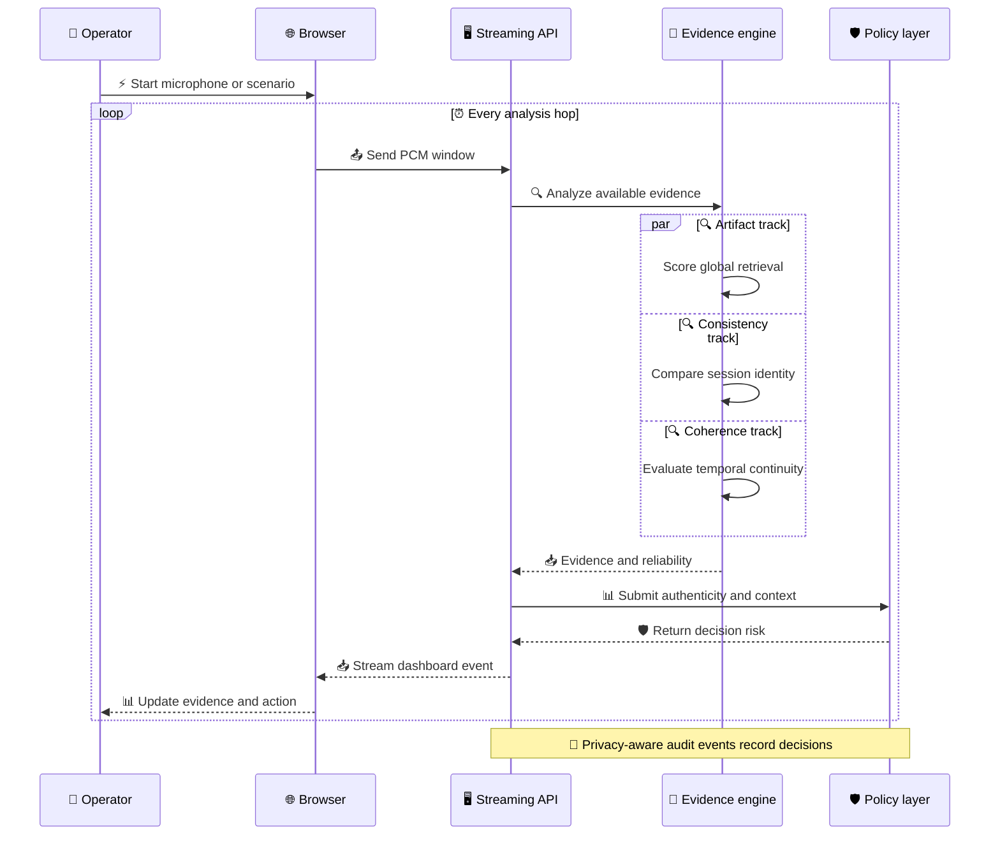
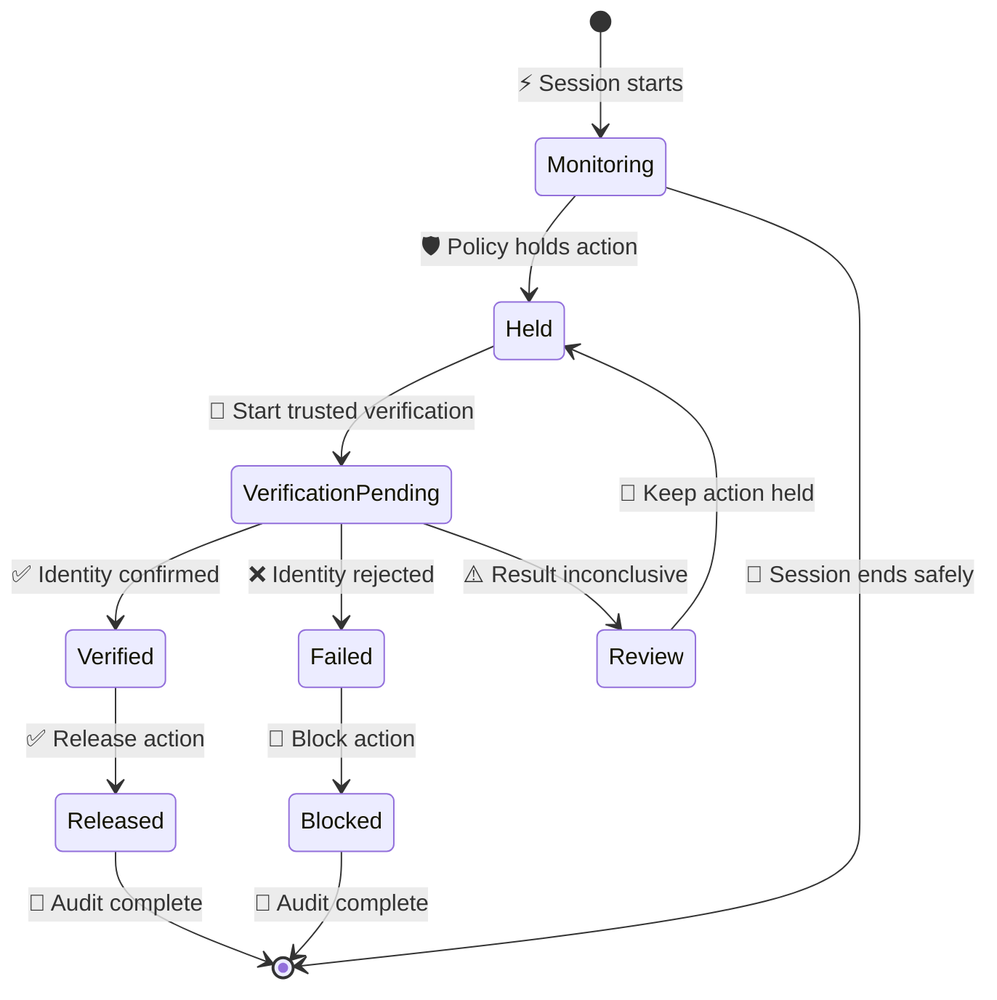

# STRIVE

_Streaming Training-free Real-time Identity-Verification Engine · SIH26104 · Team Null Pointer_

---

STRIVE is a real-time **voice-cloning risk and intervention prototype**. It turns microphone audio, uploaded recordings, or deterministic presentation scenarios into continuously updated evidence, keeps signal risk separate from business context, and demonstrates how a sensitive action can be held until trusted verification finishes.

> ⚠️ **Scope:** The default **DEMO DSP** mode proves the streaming, evidence, dashboard, and prevention workflow. Its procedural scores are not validated neural detection accuracy, and “low risk” does not mean identity verified.

[Launch the experience](#quick-start) · [Open the project overview PDF](docs/STRIVE_Project_Overview.pdf) · [Follow the presentation runbook](docs/SIH_PRESENTATION_RUNBOOK.md) · [Read the API reference](docs/API.md)

## 📋 What the project delivers

| Capability | What STRIVE does |
| --- | --- |
| **Live inputs** | Accepts microphone PCM, uploaded audio, and repeatable demo scenarios |
| **Streaming analysis** | Normalizes to 16 kHz mono and evaluates overlapping 2-second windows |
| **Evidence fusion** | Combines artifact, session-consistency, and coherence signals with availability and reliability |
| **Risk separation** | Keeps authenticity risk, context risk, and policy decision risk distinct |
| **Prevention workflow** | Holds a sensitive action, starts trusted verification, then releases, blocks, or routes to review |
| **Operator experience** | Opens on a premium landing page before entering the real-time dashboard |
| **Auditability** | Emits privacy-aware events, health data, metrics, and reproducible presentation evidence |
| **Runtime choices** | Supports the Python/FastAPI application and an optional Rust-native audio runtime |

The product journey is intentionally progressive: explain the problem first, show the detection surface second, and demonstrate intervention only when the evidence warrants it.

<details open>
<summary><strong>📋 Explore the product journey</strong></summary>



</details>

---

## ⚡ Quick start

Python 3.12 is required for the pinned demo environment.

```bash
python3.12 -m venv .venv
.venv/bin/python -m pip install -r requirements-demo.lock
./scripts/presentation.sh
```

On Windows PowerShell:

```powershell
py -3.12 -m venv .venv
.venv\Scripts\python.exe -m pip install -r requirements-demo.lock
.\scripts\presentation.ps1
```

The launcher runs preflight checks and serves the application on loopback:

| Route | Purpose |
| --- | --- |
| `http://127.0.0.1:8000/` | Product landing page |
| `http://127.0.0.1:8000/dashboard` | Real-time operator dashboard |
| `http://127.0.0.1:8000/docs` | Interactive API documentation |
| `STRIVE_Demo.html` | Offline replay fallback with no live model or microphone |

FFmpeg is optional for WAV/FLAC and required for MP3, M4A, AAC, OGG, Opus, and WebM uploads. Raw uploaded or microphone PCM and voice embeddings are not persisted by default.

### Recommended demonstration

1. Open the landing page and select **Launch Live Console**
2. Enable **Presentation Mode** in the dashboard
3. Run **Mid-Call Voice Replacement**
4. Watch the temporary profile become trusted and the source change at 15 seconds
5. Select **Hold & Verify**, then resolve the simulation as **Failed**, **Verified**, or **Review**

Use only consented or licensed voice data. No human voice recordings ship with this repository; the [audio importer guide](data/demo/README.md) explains how to add approved samples.

## ⚙️ How STRIVE works

All three input methods enter the same bounded streaming pipeline. Channel degradation adjusts evidence reliability; it never becomes evidence of spoofing. Missing or stale evidence is marked unavailable rather than silently converted to zero.

<details open>
<summary><strong>🔧 Inspect the streaming architecture</strong></summary>



</details>

---

The central safety invariant is:

```text
AUTHENTICITY RISK != CONTEXT RISK != DECISION RISK
```

| Risk | Meaning | Used for |
| --- | --- | --- |
| **Authenticity** | What the available audio evidence currently suggests | Signal-level assessment |
| **Context** | How sensitive the requested action is | Business impact |
| **Decision** | What policy should do with both inputs | Hold, release, block, or review |

<details>
<summary><strong>📋 Follow one live analysis window</strong></summary>



</details>

---

## 🔐 Prevention state machine

STRIVE demonstrates intervention instead of treating detection as the finish line. A high-impact action can be paused while an independent verification path decides what happens next.

<details open>
<summary><strong>🔐 Explore prevention outcomes</strong></summary>



</details>

---

The callback, MFA, and supervisor paths are simulations. They do not contact a real bank, telecom provider, or identity system.

## 📚 Repository guide

| Area | Key paths | Responsibility |
| --- | --- | --- |
| **Product UI** | `web/landing.html`, `web/index.html`, `web/*.css`, `web/*.js` | Landing experience, dashboard, AudioWorklet capture |
| **Streaming core** | `strive/audio.py`, `capture.py`, `scheduler.py`, `streaming.py` | Decode, buffer, window, and transport audio |
| **Evidence engine** | `strive/engine.py`, `branches.py`, `channel.py`, `retrieval.py` | Evidence branches, reliability, temporal fusion |
| **Decision layer** | `strive/policy.py`, `audit.py`, `telemetry.py` | Risk policy, prevention state, audit, metrics |
| **Application API** | `strive/api.py` | HTTP, WebSocket, static frontend, health endpoints |
| **Research adapters** | `strive/models/research.py` | Fail-closed frozen NII/XLSR pathway |
| **Native runtime** | `native/audio-runtime/` | Optional Rust audio server and worker bridge |
| **Tooling** | `scripts/` | Setup, launch, benchmarks, model preparation, evidence |
| **Verification** | `tests/`, `evidence/` | Contracts, regression tests, recorded outputs |

Start with [architecture](docs/ARCHITECTURE.md), [requirements](docs/REQUIREMENTS.md), [models](docs/MODELS.md), [native audio](docs/NATIVE_AUDIO.md), and the [MVP gap analysis](docs/SIH_MVP_GAP_ANALYSIS.md) before changing scientific behavior.

## 🧪 Validation

Run the main local checks from the repository root:

```bash
python -m pytest -q
node --check web/app.js
node --check web/landing.js
node --check web/pcm-worklet.js
node tests/audio_worklet.cjs
python scripts/build_demo.py
python scripts/presentation_check.py
python scripts/presentation_evidence.py
cargo check --locked --manifest-path native/audio-runtime/Cargo.toml
```

With the Python server already running:

```bash
python scripts/smoke.py
```

Recorded evidence and its limits live in [validation](docs/VALIDATION.md) and `evidence/sih-final/`. Do not report deterministic DSP scenario scores as neural detection metrics.

### Current verification snapshot

| Check | Status | Notes |
| --- | --- | --- |
| Focused API and presentation tests | Passed | `14 passed`; three dependency deprecation warnings |
| Frontend JavaScript syntax | Passed | Dashboard, landing page, and AudioWorklet checked |
| Responsive browser review | Passed | Landing and dashboard checked at desktop and mobile widths |
| Rust native runtime compile | Passed | `cargo check --locked` completed |
| Full Python suite | Needs follow-up | `182 passed, 1 skipped`; live-stream and native configuration integration remain open |

## 📋 Final checklist

### Completed in the prototype

- [x] Lead with a dedicated product landing page at `/`
- [x] Route operators into the real-time dashboard at `/dashboard`
- [x] Support microphone, upload, and deterministic scenario inputs
- [x] Keep artifact, consistency, coherence, and channel evidence visible
- [x] Keep authenticity, context, and decision risk separate
- [x] Demonstrate hold, verify, release, block, and review outcomes
- [x] Provide privacy-aware audit, health, metrics, and evidence outputs
- [x] Provide a self-contained offline replay fallback
- [x] Provide an optional Rust-native audio runtime
- [x] Document the project from product intent through technical operation

### Required before a production claim

- [ ] Align the Python WebSocket route with the `pcm-v2` live-stream handshake
- [ ] Align `config/live.json` with the native runtime `Settings` schema and shutdown contract
- [ ] Rerun the full suite until all live-stream and native integration tests pass
- [ ] Provision licensed model weights and a consented evaluation corpus
- [ ] Calibrate thresholds and report accuracy with confidence intervals
- [ ] Validate Indian languages, code-mixing, unseen generators, and codec conditions
- [ ] Complete physical microphone testing on target presentation hardware
- [ ] Integrate a real call, SIP, callback, MFA, or supervisor provider
- [ ] Add production authentication, authorization, retention, scaling, and legal controls

## 🔍 Research mode and limitations

The intended neural prototype path uses frozen `nii-yamagishilab/mms-300m-anti-deepfake` and an XLSR phoneme model with a labelled FAISS reference index. Model weights and speech corpora are not committed. Review the model license and data permissions before any use outside the documented research scope.

```bash
python -m pip install -r requirements-research.txt
python scripts/prepare_models.py
python scripts/presentation.py --research
```

Research mode fails closed on missing files, checksum mismatches, incorrect input geometry, fixture indexes, and model/index incompatibility. It does not silently fall back to demo DSP.

This MVP does **not** currently provide a SIP/Asterisk connection, real money transfer, live trusted callback/MFA, production IAM, calibrated probabilities, or validated multilingual accuracy. Those boundaries are release gates, not hidden assumptions.

## 🔗 Project documents

| Document | Use it for |
| --- | --- |
| [Project overview PDF](docs/STRIVE_Project_Overview.pdf) | Start-to-finish product and system briefing |
| [Product direction](PRODUCT.md) | Experience principles and visual direction |
| [Architecture](docs/ARCHITECTURE.md) | Components, data flow, and design constraints |
| [API reference](docs/API.md) | HTTP and WebSocket contracts |
| [Audio real-time handoff](docs/AUDIO_REALTIME_HANDOFF.md) | Streaming contract and integration notes |
| [Native audio runtime](docs/NATIVE_AUDIO.md) | Rust runtime setup and operation |
| [Model documentation](docs/MODELS.md) | Demo and research model behavior |
| [Validation](docs/VALIDATION.md) | Test evidence, claims, and limitations |
| [Presentation runbook](docs/SIH_PRESENTATION_RUNBOOK.md) | Judge-ready demonstration sequence |
| [MVP gap analysis](docs/SIH_MVP_GAP_ANALYSIS.md) | Remaining risks and production gaps |
