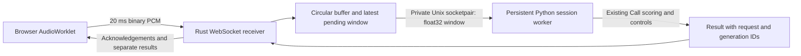

# Rust audio runtime with Python detection

The native runtime is an opt-in implementation of the live `pcm-v2` path.
Rust owns packet validation, the fixed-allocation circular buffer, overlapping
windows, bounded pending work, timestamps and worker supervision. Python retains
the existing detector, channel calculations, fusion, verification and audit logic.



## Build and run

Requires the existing Python environment and a Rust toolchain. Tested with Python
3.12 and Rust 1.96.0 on Linux. Unix socketpairs currently limit this launcher to
Linux/macOS; macOS execution has not been tested.

```bash
cargo build --release --locked --manifest-path native/audio-runtime/Cargo.toml
.venv/bin/python -E scripts/start_native.py --port 8000
```

Open `http://127.0.0.1:8000` and select **Use microphone**. The default configuration
is `config/live.json`: two-second windows, half-second hops, 20 ms packets and one
pending scoring window. The existing Python launcher remains available:

```bash
STRIVE_CONFIG=config/live.json .venv/bin/python -E scripts/start.py
```

For a prepared research model bundle:

```bash
.venv/bin/python -E scripts/start_native.py --config config/research.json \
  --max-sessions 1 --startup-timeout-ms 120000 --worker-timeout-ms 5000
```

Each active call owns a separate Python process and model instance. Models load once
per session, not once per window. Admission is bounded by `max_sessions`. Account for
model RAM/VRAM before increasing that limit; this prototype does not share one GPU
model across workers. Startup time is separate from warmed inference latency.

The server binds only to loopback. `STRIVE_API_TOKEN` retains HTTP bearer and first
WebSocket-message authentication. Worker sockets are inherited private handles with
no network listener, path or pickle serialization. Root/assets, readiness, live call
creation/deletion, context, mock verification, transaction and active-call audit are
supported. Uploads, canned scenarios, legacy JSON streaming and REST audio chunks
stay on the Python service; native capabilities disable those source buttons.
Native `/metrics` returns JSON session/generation/queue counters rather than the
Python service's Prometheus text format.

## Python integration contract

`strive/native_worker.py` loads `create_app(Settings(...))` once and uses its existing
ASGI control handlers. Complete windows go directly to `Call._score`; model logic is
not ported or replaced. PCM is 16 kHz mono little-endian float32, exactly reconstructed
from the browser's int16 samples. Sample offsets describe start/end and the new suffix,
so overlapping samples are not counted as new voiced evidence.

Requests use an 8-byte header: little-endian u32 JSON length and u32 PCM byte length,
then JSON and PCM. Replies use u32 JSON length plus JSON. Metadata contains operation,
request ID, generation, sample offsets, ingestion sequence, queue time and capture
counters. Limits are 1 MB JSON and ten seconds of PCM. JSON float round-trip support
preserves the Python scores through Rust serialization. The same worker processes
control requests sequentially with scoring, preserving session state.

To integrate a detector, keep the existing extractor contract and research config.
The worker code and `create_app` choose the model; Rust does not need model-specific
changes. The current deployment creates one model instance per admitted call.

## Overload, failure and cleanup

- Acknowledgements confirm reception, independently of detector execution.
- The pending queue discards oldest windows when full and reports every discard.
  In-flight inference is allowed to finish until its deadline.
- A worker timeout, exit, malformed reply or mismatched request/generation/window
  invalidates the worker. Rust kills and reaps it, increments the generation and
  reports `WORKER_UNAVAILABLE`/`ANALYZING`; capture continues.
- The next scoring attempt starts a replacement. Its session profile is empty and
  bootstrap state is `blocked_gap`, so old identity history is never carried over.
- Disconnect/deletion cancels pending worker RPC and kills the child. There is no
  need to wait indefinitely for a native model thread. Idle sessions expire; SIGINT
  and SIGTERM close active sessions before the service exits.
- State and raw PCM are transient. Workers use the configured scalar audit store;
  waveform payloads and embeddings are excluded by the existing audit whitelist.

## Timing and evidence

The common `compute`, `queue`, `end_to_end` and `audio_lag` fields remain available.
Native events add:

| Field | Boundary |
|---|---|
| `native_window_to_result` | Rust window completion to validated worker result, including dispatch and IPC |
| `worker_roundtrip` | Worker dispatch through reply; includes worker startup on recovery |
| `generation` | Worker generation that produced the result |

Two seconds of window collection still precede the first eligible result. Neither
language choice nor process isolation removes the detector's evidence requirement.
Loopback timing does not establish physical microphone or WAN latency.

```bash
cargo test --locked --manifest-path native/audio-runtime/Cargo.toml
.venv/bin/python -E -m pytest -q tests/test_native_runtime.py
.venv/bin/python -E scripts/benchmark_runtimes.py --seconds 10
```

`evidence/native-comparison.json` records 1/4/8-call measurements with the same DSP
fixture, window geometry, thread limits and in-memory audit in both implementations.
It includes p50/p95/p99, packet acknowledgements, discarded windows, queue depth,
approximate process-tree CPU and summed RSS (which double-counts shared pages).
These are software/runtime measurements, not trained-detector accuracy results.

Native integration tests compare complete scores and voiced evidence against the
Python path, exercise overload, freeze a worker with SIGSTOP to prove recovery,
and check authentication, producer ownership, capacity and existing call controls.
